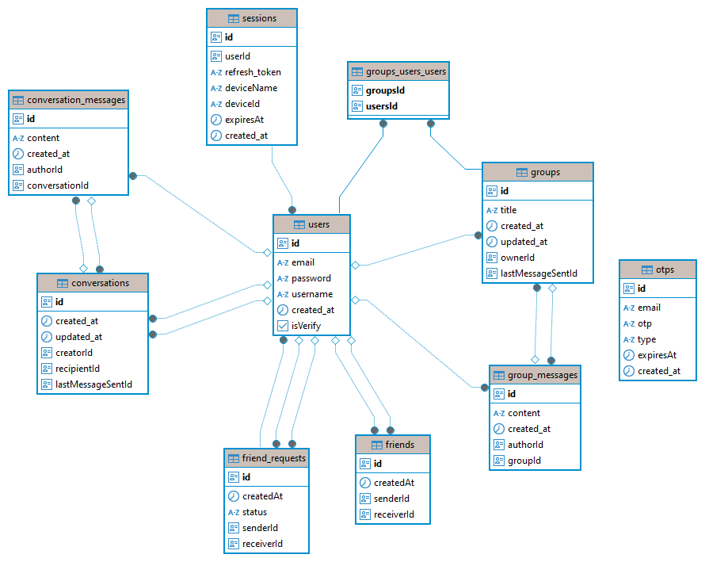

## 🧩 WebSocket Group Chat API – Backend Developer Assignment

Objective: Develop a WebSocket-based group chat API enabling real-time communication with persistent chat history, accessible from both mobile and web platforms.

---

## 🚀 Technologies Used

- **NestJS**: Backend framework
- **TypeORM**: ORM for database operations
- **PostgreSQL**: Database
- **Socket.IO**: WebSocket library
- **Swagger (OpenAPI)**: API documentation
- **Docker & Docker Compose**: Containerization
- **Dotenv**: Environment variable configuration.
- **@nestjs/jwt**: For handling JSON Web Token-based authentication.

---

## 📦 Features

    ✅ Real-time group chat via WebSocket

    ✅ JWT Authentication (Access + Refresh Token)

    ✅ Real-time one-to-one (1:1) chat

    ✅ Message history stored in PostgreSQL

    ✅ REST API to fetch chat history

    ✅ JWT-based user authentication

    ✅ Swagger for API documentation

    ✅ Dockerized setup for easy local development

    ✅ Ready for integration with web and mobile apps

---

## 🌍 Deploy URL

If you've deployed your application to a platform like

## ⚙️ Local Setup Instructions

# 🧪 Run Locally

```bash
  git clone https://github.com/dungha3112/test-chat-nestjs
  cd test-chat-nest
  npm i
```

# 🌍 Environment Configuration

```bash

PORT=number
DATABASE_URL=string

JWT_ACCESS_SECRET=string
JWT_ACCESS_EXPIRES_IN=1d

REFRESH_TOKEN_SECRET=string
JWT_REFRESH_EXPIRES_IN=7d


CRYPTO_KEY=string

EMAIL_APP_ADDRESS=your_email@gmail.com
EMAIL_APP_PASSWORD=your_password_email


BASE_CLIENT_URL=http://locahost_client:

```

# How to run the project with Docker

- Node.js (>= 20)
- [Docker](https://www.docker.com/)
- [Docker Compose](https://docs.docker.com/compose/)

Build and start the container

```bash
 docker-compose up --build
```

Access the app: http://localhost:3000

---

---

## 🔌 Access Points

WebSocket Endpoint: ws://localhost:3000

Swagger UI: http://localhost:3000/api/

---

## 📡 Chat API – Documentation Overview

# 🔍 Description

This API provides a real-time chat platform supporting both group chat and private 1-1 conversations, designed for both mobile and web clients. Built using WebSockets and RESTful endpoints, the system enables robust communication features including:

User authentication and account management

Real-time group and private messaging

Group creation, user management, and ownership transfer

Friend system with requests, accept/reject flows

Persistent chat history with CRUD operations for messages

## Architecture Diagram

                               +------------------------+
                               |   Client (Web/Mobile)  |
                               +-----------+------------+
                                           |
                                    WebSocket + REST API
                                           |
                              +------------+------------+
                              |     NestJS Backend      |
                              |                         |
                              |      +-----------+      |
                              |      |  Gateway  |      |
                              |      +-----------+      |
                              |           |             |
                              |           ▼             |
                              |     +------------+      |
                              |     | EventModule|      |
                              |     +------------+      |
                              |        /      \         |
                              |       /        \        |
                              ▼      ▼          ▼       ▼
                          +----------------+  +----------------+
                          | Conversation   |  |     Group      |
                          |    Module      |  |     Module     |
                          |----------------|  |----------------|
                                /                   \
                               /                     \
                              ▼                       ▼
       +----------------+------------------+   +----------------+------------------+
       | - ConversationController          |   | - GroupController                 |
       | - ConversationMessageController   |   | - GroupMessageController          |
       |                                   |   | - GroupRecipientController        |
       +----------------+------------------+   +----------------+------------------+
                        |---------------------------------------|
                                             |
                                    TypeORM (Repository)
                                             |
                                      +----------------+
                                      | PostgreSQL DB  |
                                      +----------------+

---

## 🔐 Auth Module (`/api/auth`)

| Method | Endpoint           | Description                                |
| ------ | ------------------ | ------------------------------------------ |
| POST   | `/register`        | Register account                           |
| POST   | `/active-account`  | Active account                             |
| POST   | `/forgot-password` | Forgot password                            |
| POST   | `/reset-password`  | Reset password                             |
| POST   | `/login`           | Login user                                 |
| POST   | `/refresh-token`   | Get new access token using refresh token   |
| POST   | `/logout`          | Logout user and clear refresh token cookie |

---

## 👤 User Module (`/api/user`)

| Method | Endpoint  | Description             |
| ------ | --------- | ----------------------- |
| GET    | `/search` | Search user by username |

---

## 👥 Group Module (`/api/group`)

### Group Management

| Method | Endpoint      | Description               |
| ------ | ------------- | ------------------------- |
| POST   | `/`           | Create new group          |
| GET    | `/`           | Get list of groups        |
| GET    | `/{id}`       | Get a group by id         |
| PATCH  | `/{id}`       | Owner updates group by id |
| PATCH  | `/{id}/owner` | Transfer ownership        |
| DELETE | `/{id}/leave` | User leaves group         |

### Group Members

| Method | Endpoint          | Description            |
| ------ | ----------------- | ---------------------- |
| POST   | `/{id}/recipient` | Add new user to group  |
| DELETE | `/{id}/recipient` | Remove user from group |

### Group Messages

| Method | Endpoint                    | Description                |
| ------ | --------------------------- | -------------------------- |
| POST   | `/{id}/message`             | Create a new group message |
| GET    | `/{id}/message`             | Get messages by group ID   |
| PATCH  | `/{id}/message/{messageId}` | Update a message by ID     |
| DELETE | `/{id}/message/{messageId}` | Delete a message by ID     |

---

## 💬 Conversation Module (`/api/conversation`)

### Conversations

| Method | Endpoint | Description               |
| ------ | -------- | ------------------------- |
| POST   | `/`      | Create a new conversation |
| GET    | `/`      | Get conversations         |
| GET    | `/{id}`  | Get a conversation by id  |

### Conversation Messages

| Method | Endpoint                    | Description                         |
| ------ | --------------------------- | ----------------------------------- |
| POST   | `/{id}/message`             | Create a new conversation message   |
| GET    | `/{id}/message`             | Get messages by conversation ID     |
| PATCH  | `/{id}/message/{messageId}` | Edit a conversation message by ID   |
| DELETE | `/{id}/message/{messageId}` | Delete a conversation message by ID |

---

## 🤝 Friend Module (`/api/friend`)

| Method | Endpoint       | Description     |
| ------ | -------------- | --------------- |
| GET    | `/`            | Get friends     |
| GET    | `/search`      | Search friends  |
| DELETE | `/{id}/delete` | Delete a friend |

---

## 🤝 Friend Request Module (`/api/friend-request`)

| Method | Endpoint       | Description                 |
| ------ | -------------- | --------------------------- |
| GET    | `/`            | Get list of friend requests |
| POST   | `/`            | Create new friend request   |
| PATCH  | `/{id}/accept` | Accept friend request       |
| PATCH  | `/{id}/reject` | Reject friend request       |
| DELETE | `/{id}/delete` | Delete friend request       |

---

## 🧪 Swagger UI

You can test the API directly at:

👉 [http://localhost:3000/api](http://localhost:3000/api)

---

## 📡 WebSocket Gateway – Real-Time Messaging (Conversation & Group)

This WebSocket gateway handles real-time communication for two main features:

1-on-1 conversations

Send request friend, accept, reject, delete friend

Create new conversation

Group chats

It broadcasts relevant events to connected clients who have joined specific "rooms" based on conversation or group IDs.

✅ Features

👤 Conversation (1-on-1 Messaging)

Emitted events:

**onConversationCreate** : when a conversation is created

**onConversationUpdate** : when a conversation is updated

**onConversationDelete** : when a conversation is deleted

**onConversationMessageCreate** : when a new message is sent

**onConversationMessageEdit** : when a message is edited

**onConversationMessageDelete** : when a message is deleted

👥 Group Messaging
Room name: group-${groupId}

Emitted events:

**onGroupCreate** : when a new group is created

**onGroupUpdate** : when group information is updated

**onGroupOwnerUpdate** : when the group owner changes

**onGroupMemberAdd** : when a member is added

**onGroupMemberRemove** : when a member is removed

**onGroupMessageCreate** : when a new group message is sent

**onGroupMessageEdit** : when a group message is edited

**onGroupMessageDelete** : when a group message is deleted

📲 Joining Rooms
To receive real-time updates, the client must join the appropriate room after authenticating via socket:

```bash

  const socket = io('http://localhost:3000', {
    auth: {
      token: 'your_jwt_token'
    }
  });

```

Users must send a valid JWT token in the auth.token field during WebSocket connection.

```bash

  socket.emit("onGroupJoin", {id: "groupId"})

```

To leave:

```bash

  socket.emit("onGroupLeave", {id: "groupId"})

```

🧠 Notes
All rooms are dynamically named by prefixing either conversation- or group- with their corresponding IDs.

Only clients who join a room will receive that room’s updates.

JWT authentication is expected during WebSocket connection handshake.

---

## 🗃️ Database Entities Overview

### 📄 Users (`users`)

- `id`, `email`, `username`, `password`, `isVerify`, `createdAt`

### 📄 Sessions (`sessions`)

- Stores refresh tokens, device info, and expiry times

### 📄 OTPs (`otps`)

- For email verification / authentication
- Fields: `email`, `otp`, `type`, `expiresAt`

### 📄 Friend Requests (`friend_requests`)

- Sender, receiver, status (`pending`, `accepted`, `rejected`)

### 📄 Friends (`friends`)

- Represents accepted friend connections

### 📄 Conversations (`conversations`)

- 1-on-1 chats between two users
- Fields: `creator`, `recipient`, `lastMessageSent`, `lastMessageSentAt`

### 📄 Conversation Messages (`conversation_messages`)

- Messages inside a 1-on-1 conversation
- Inherits from `BaseMessage` (which has `id`, `content`, `createdAt`, `author`)

### 📄 Groups (`groups`)

- Group chats with multiple users
- Fields: `title`, `users[]`, `owner`, `lastMessageSent`, `lastMessageSentAt`

### 📄 Group Messages (`group_messages`)

- Messages inside a group chat
- Inherits from `BaseMessage`

---



## 🧱 Project Structure

```bash

src
│   app.module.ts
│   main.ts
│
├───auth
│   │   auth.controller.ts
│   │   auth.module.ts
│   │   auth.service.ts
│   │
│   ├───dtos
│   │       active-account.dto.ts
│   │       index.ts
│   │       refresh-token.dto.ts
│   │       user-login.dto.ts
│   │       user-register.dto.ts
│   │
│   └───guards
│           LocalStrategy.ts
│
├───conversation
│   │   conversation.module.ts
│   │
│   ├───controllers
│   │       conversation-message.controller.ts
│   │       conversation.controller.ts
│   │
│   ├───dtos
│   │   │   index.ts
│   │   │
│   │   ├───conversations
│   │   │       conversation-create.dto.ts
│   │   │
│   │   └───messages
│   │           conversation-message-edit.dto.ts
│   │           conversation-message.create.dto.ts
│   │
│   ├───middlewares
│   │       conversation.middleware.ts
│   │
│   └───services
│           conversation-mesage.service.ts
│           conversation.service.ts
│
├───custom-jwt
│   │   custom-jwt.module.ts
│   │   custom-jwt.service.ts
│   │
│   └───guards
│           JwtStrategy.ts
│
├───database
│       database.module.ts
│
├───email
│       emai.service.ts
│       email.module.ts
│
├───events
│   │   events.module.ts
│   │
│   ├───conversations
│   │       conversation-message.event.ts
│   │       conversation.event.ts
│   │
│   ├───friends
│   │       friend-request.event.ts
│   │       friend.event.ts
│   │
│   └───groups
│           group-message.event.ts
│           group-recipient.event.ts
│           group.event.ts
│
├───friend
│   │   friend.module.ts
│   │
│   ├───controllers
│   │       friend-request.controller.ts
│   │       friend.controller.ts
│   │
│   ├───dtos
│   │   ├───friend-request
│   │   │       friend-request.dto.ts
│   │   │       index.ts
│   │   │
│   │   └───friends
│   │           index.ts
│   │
│   └───services
│           friend-request.service.ts
│           friend.service.ts
│
├───gateway
│       gateway.adapter.ts
│       gateway.module.ts
│       gateway.session.ts
│       gateway.ts
│
├───group
│   │   group.module.ts
│   │
│   ├───controllers
│   │       group-message.controller.ts
│   │       group-recipient.controller.ts
│   │       group.controller.ts
│   │
│   ├───dtos
│   │   │   index.ts
│   │   │
│   │   ├───groups
│   │   │       group-add-user.dto.ts
│   │   │       group-create.dto.ts
│   │   │       group-edit.dto.ts
│   │   │
│   │   ├───messages
│   │   │       group-message-create.dto.ts
│   │   │       group-message-edit.dto.ts
│   │   │
│   │   └───recipients
│   │           group-recipient.add.dto.ts
│   │           group-recipient.remove.dto.ts
│   │
│   ├───middlewares
│   │       group.middleware.ts
│   │
│   └───services
│           group-message.service.ts
│           group-recipients.service.ts
│           group.service.ts
│
├───otp
│   │   otp.module.ts
│   │   otp.service.ts
│   │
│   └───dtos
├───user
│   │   user.controller.ts
│   │   user.module.ts
│   │   user.service.ts
│   │
│   └───dtos
│           index.ts
│
└───utils
    ├───constants
    │       event.constant.ts
    │       index.ts
    │       routes.constant.ts
    │       services.constant.ts
    │
    ├───decorators
    │       auth-user.decorator.ts
    │       index.ts
    │
    ├───guards
    │       AuthJwtGuard.ts
    │       index.ts
    │       LocalAuthGuard.ts
    │
    ├───helpers
    │       index.ts
    │       otp.helper.ts
    │       password.helper.ts
    │
    ├───interfaces
    │       auth.interface.ts
    │       conversation-message.interface.ts
    │       conversation.interface.ts
    │       custom-jwt.interface.ts
    │       email.interface.ts
    │       friend-request.interface.ts
    │       friend.interface.ts
    │       gateway.interface.ts
    │       group-message.interface.ts
    │       group-recipients.interface.ts
    │       group.interface.ts
    │       index.ts
    │       otp.interface.ts
    │       user.interface.ts
    │
    ├───middlewares
    │       auth.middeware.ts
    │       index.ts
    │
    ├───swaggers
    │       auth.swagger.ts
    │       conversation-message.swagger.ts
    │       conversation.swagger.ts
    │       friend-request.swagger.ts
    │       friend.swagger.ts
    │       group-message.swagger.ts
    │       group-recipient.swagger.ts
    │       group.swagger.ts
    │       index.ts
    │
    ├───typeorm
    │   │   index.ts
    │   │
    │   └───entities
    │           base-message.entity.ts
    │           conversation-message.entity.ts
    │           conversation.entity.ts
    │           friend-request.entity.ts
    │           friend.entity.ts
    │           group-message.entity.ts
    │           group.entity.ts
    │           index.ts
    │           otp.entity.ts
    │           session.entity.ts
    │           user.entity.ts
    │
    └───types
            auth.type.ts
            conversation-message.type.ts
            conversation.type.ts
            custom-jwt.type.ts
            friend-request.type.ts
            friend.type.ts
            group-message.type.ts
            group-recipients.type.ts
            group.type.ts
            index.ts
            message.type.ts
            otp.type.ts
            user.type.ts

```

---

## ✅ Optional Additions You Could Include

🔒 Authentication Overview

This app uses JWT (via @nestjs/jwt) for secure authentication. On successful login, a JWT token is returned. Protected routes and WebSocket connections require this token.

Example WebSocket auth flow:

Connect to WebSocket with JWT as a query parameter:
ws://localhost:3000

## Bonus: Deployment

    The application is deployed on Render and can be accessed via:

👉 [https://test-chat-nestjs.onrender.com/api](https://test-chat-nestjs.onrender.com/api)

## 📤 Future Enhancements

Add file/image messaging support

Support for typing indicators, online status

Push notification integration

Call video, cal audio 1-1, 1-n

Admin/moderation tools

Redis support for scaling WebSocket servers
